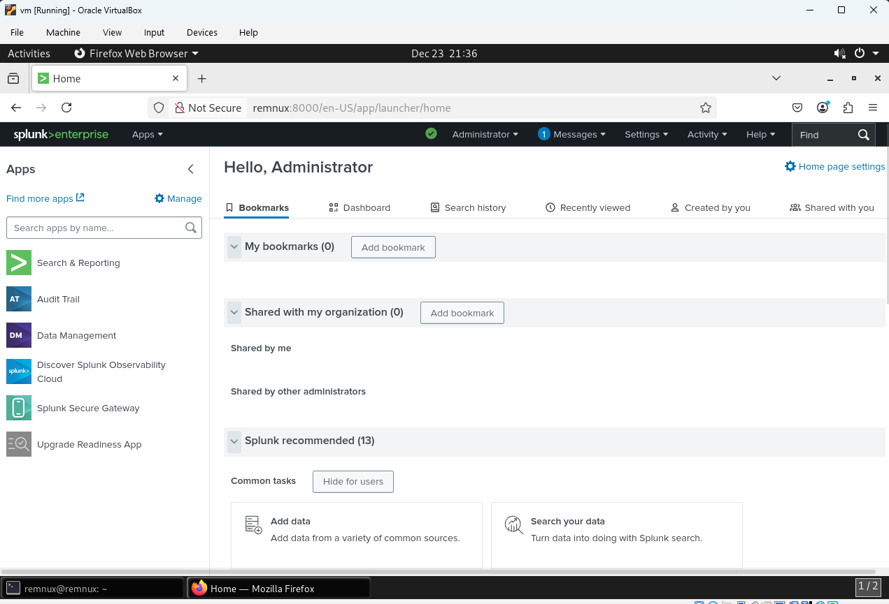
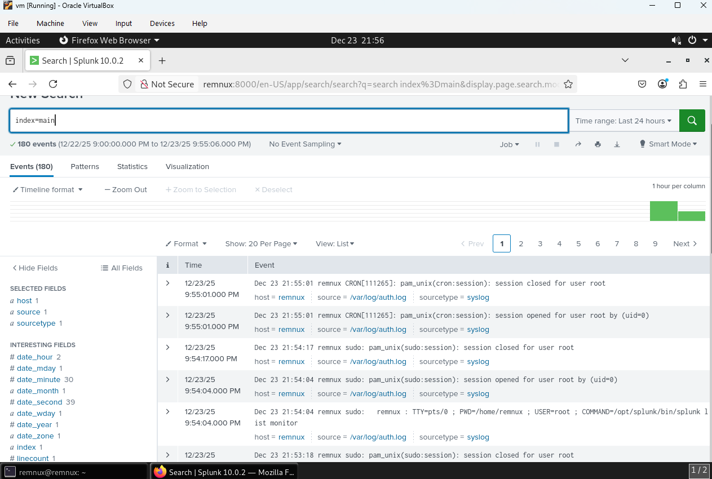
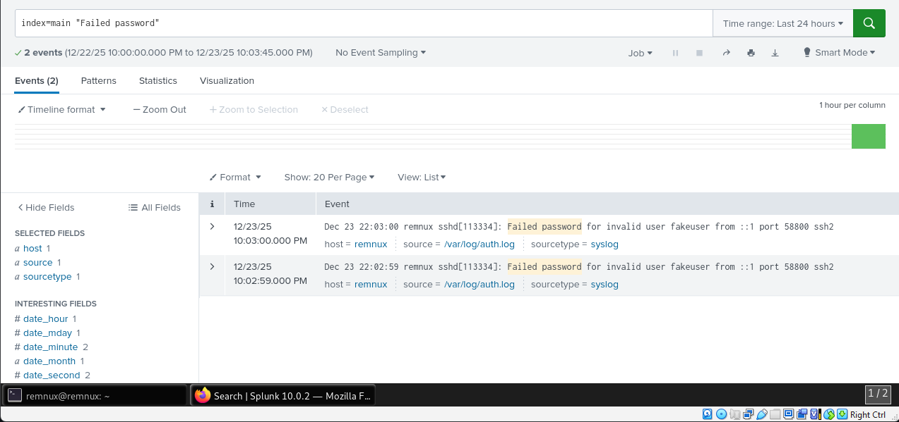
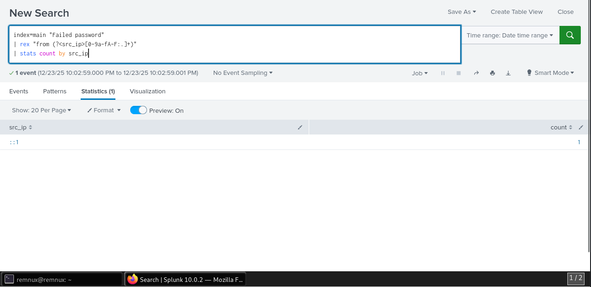
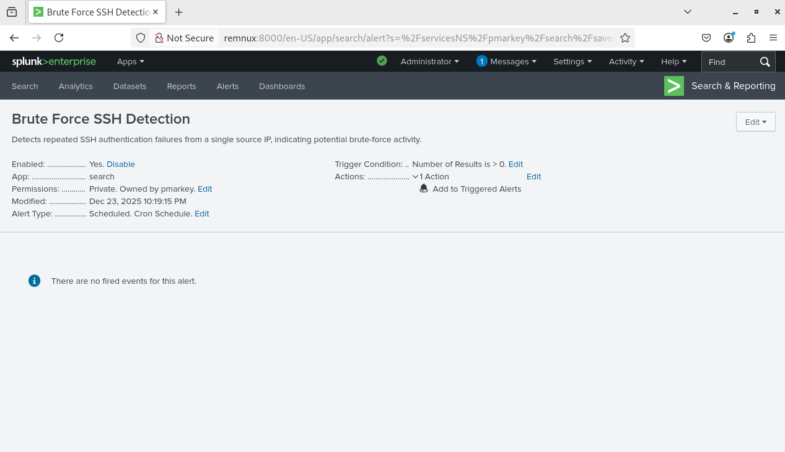

# Splunk SIEM Lab – SSH Brute Force Detection

## 📌 Overview
This project demonstrates a hands-on Splunk SIEM deployment on Linux, focusing on authentication log ingestion, failed SSH login detection, and alerting for potential brute-force attacks.

The lab follows a SOC-style workflow:
**log ingestion → detection → analysis → alerting**.

---

## 🧱 Lab Environment
- **Platform:** Oracle VirtualBox
- **OS:** REMnux (Linux)
- **SIEM:** Splunk Enterprise 10.x
- **Log Source:** `/var/log/auth.log`
- **Access Method:** SSH (local simulation)

---

## ⚙️ Splunk Setup – Web Interface
Splunk Enterprise was installed and accessed via the web interface.

---

## 📥 Log Ingestion – Index Validation
Authentication logs were monitored and indexed into Splunk.

**Monitored log file:**
/var/log/auth.log

yaml
Copy code

Events were confirmed in the `main` index.

---

## 🔍 Failed SSH Login Detection
Failed SSH authentication attempts were identified using standard `sshd` failure messages.

index=main "Failed password"
This confirms visibility into failed login activity.

🚨 Brute Force Detection
Repeated failed authentication attempts were aggregated by source IP to detect potential brute-force behavior.

index=main "Failed password"
| rex "from (?<src_ip>[0-9a-fA-F:.]+)"
| stats count by src_ip
| where count >= 1
| sort - count
This detection supports both IPv4 and IPv6 addresses (e.g., ::1).

📊 Time-Based Analysis
Failed SSH attempts were analyzed over time to identify spikes or attack patterns.

index=main "Failed password"
| timechart count

🚨 Alerting – Operational Detection
A scheduled Splunk alert was created to operationalize the brute-force detection.

Alert Configuration:

Name: Brute Force SSH Detection

Schedule: Every 5 minutes (cron-based)

Trigger: Number of results > 0

Action: Add to Triggered Alerts

cron
*/5 * * * *

🎯 Skills Demonstrated
Splunk Enterprise SIEM deployment

Linux log ingestion and validation

SPL detection engineering

Regex field extraction

IPv4 and IPv6 parsing

SSH brute-force detection

Scheduled alert configuration

SOC-style investigation workflow

🧠 Why This Lab Matters
SSH brute-force attacks are a common initial access technique. Detecting repeated authentication failures and correlating them by source IP is a core SOC responsibility for early attack detection.

yaml
Copy code
